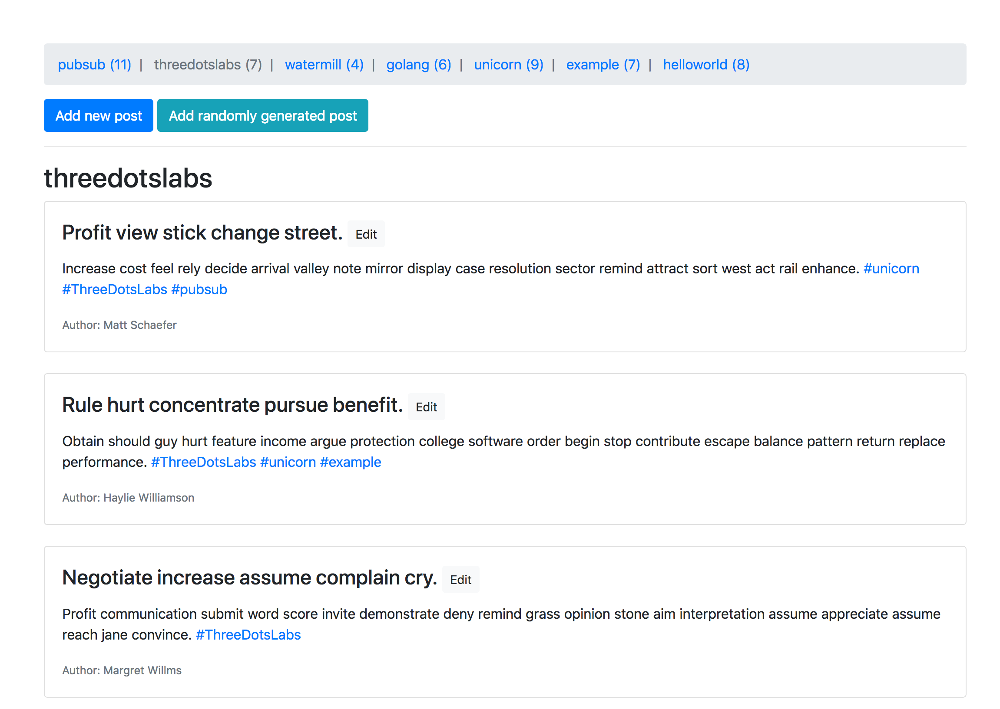
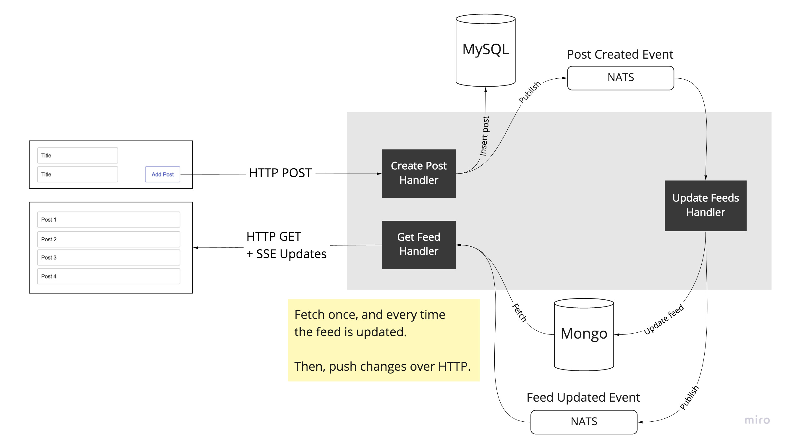

# Server-Sent Events

This example is a Twitter-like web application using [Server-Sent Events](https://en.wikipedia.org/wiki/Server-sent_events) to support real-time refreshing.



## Running

```
docker-compose up
```

Then, open  http://localhost:8080

You can add your own post or click the button to get randomly generated posts.

Either way, the feeds list and posts in a feed should be always up-to-date. Try using a second browser window to see the update.

## How it works

* Posts can be created and updated.
* Posts can contain tags.
* Each tag has its own feed that contains all posts from that tag.
* All posts are stored in MySQL. This is the Write Model.
* All feeds are updated asynchronously and stored in MongoDB. This is the Read Model.



### SSE Router

The `SSERouter` comes from [watermill-http](https://github.com/ThreeDotsLabs/watermill-http).
When creating a new router, you pass an upstream subscriber. Messages coming from that subscriber will trigger pushing updates over HTTP.

In this example, we use a simple in-process GoChannel as Pub/Sub, but this can be any Pub/Sub supported by Watermill.

```go
sseRouter, err := watermillHTTP.NewSSERouter(
    watermillHTTP.SSERouterConfig{
        UpstreamSubscriber: router.Subscriber,
        ErrorHandler:       watermillHTTP.DefaultErrorHandler,
    },
    router.Logger,
)
```

### Stream Adapters

To work with `SSERouter` you need to prepare a `StreamAdapter` with two methods.

`GetResponse` is similar to a standard HTTP handler. It should be super easy to modify an existing handler to match this signature.

`Validate` is an extra method that tells whether an update should be pushed for a particular `Message`.

```go
type StreamAdapter interface {
	// GetResponse returns the response to be sent back to client.
	// Any errors that occur should be handled and written to `w`, returning false as `ok`.
	GetResponse(w http.ResponseWriter, r *http.Request) (response interface{}, ok bool)
	// Validate validates if the incoming message should be handled by this handler.
	// Typically this involves checking some kind of model ID.
	Validate(r *http.Request, msg *message.Message) (ok bool)
}
```

An example `Validate` can look like this. It checks whether the message came for the same post ID that the user sent over the HTTP request.

```go
func (p postStreamAdapter) Validate(r *http.Request, msg *message.Message) (ok bool) {
	postUpdated := PostUpdated{}

	err := json.Unmarshal(msg.Payload, &postUpdated)
	if err != nil {
		return false
	}

	postID := chi.URLParam(r, "id")

	return postUpdated.OriginalPost.ID == postID
}
```

If you'd like to trigger an update for every message, you can simply return `true`.

```go
func (f allFeedsStreamAdapter) Validate(r *http.Request, msg *message.Message) (ok bool) {
	return true
}
```

Before starting the `SSERouter`, you need to add the handler with particular topic.
`AddHandler` returns a standard HTTP handler that can be used in any routing library.

```go
postHandler := sseRouter.AddHandler(PostUpdatedTopic, postStream)

// ...

r.Get("/posts/{id}", postHandler)
```

## Event handlers

The example uses Watermill for all asynchronous communication, including SSE.

There are several events published:

* `PostCreated`
    * Adds the post to all feeds with tags present in the post.
* `FeedUpdated`
    * Pushes update to all clients currently visiting the feed page.
* `PostUpdated`
    * Pushes update to all clients currently visiting the post page.
    * Updates post in all feeds with tags present in the post
        * a) For existing tags, the post content will be updated in the tag.
        * b) If a new tag has been added, the post will be added to the tag's feed.
        * c) If a tag has been deleted, the post will be removed from the tag's feed.

## Frontend app

The frontend application is built using Vue.js and Bootstrap.

The most interesting part is the use of `EventSource`.

```js
this.es = new EventSource('/api/feeds/' + this.feed)

this.es.addEventListener('data', event => {
    let data = JSON.parse(event.data);
    this.posts_stream = data.posts;
}, false);
```

Please note the author is not a frontend developer and the code in `index.html` is probably not idiomatic. PRs are welcome. :)